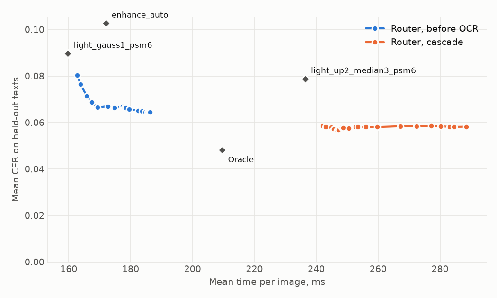

# Tesseract pipeline router benchmark

Generated: 2026-10-08. Commit: `3eccd0b`. Tesseract runs with `eng+rus`.

## Task

SnipText reads every capture with Tesseract. What varies is the pipeline: how the image is prepared (inversion of dark themes, upscaling, median or Gaussian filtering, or the preprocessing of version 0.4) and which page-segmentation mode Tesseract gets. For each image the router predicts the character error rate (CER) of each shipped pipeline and takes the one minimising predicted CER plus a time weight times the pipeline's seconds. Two routers are compared: one that sees only image statistics before any OCR, and a cascade that runs the default pipeline first and also sees its word confidences.

CER is the edit distance to the ground truth over its length, whitespace-normalised, case kept. Averages use CER clipped at 1 so that one garbage output does not dominate; the raw mean is shown next to it. Intervals are 95% bootstrap intervals that resample texts, not images, because renders of one text are not independent.

If the chosen pipeline returns no text the default pipeline runs instead; the numbers below include that rule and its time.

## Data

3580 images: train 1800, test 600, unseen_font 300, val 600, ood 80, browser 200. 750 distinct texts (1980 English and 1320 Russian renders; prose 2200, code 660, interface strings 440). Sentences come from UD English-EWT and UD Russian-GSD, code from the CPython 3.12 standard library. Each text is rendered several times with a random font, size from 11 to 30 px, one of six colour schemes and up to two degradations out of blur, noise, JPEG, rescaling and low contrast.

A text belongs to exactly one of train, validation and test. Two font families appear only in the unseen-font slice. The receipts (SROIE) and the browser pages are never used for fitting or selection.

The browser pages were rendered by Google Chrome 151.0.7922.173. Fonts: sans-serif: NotoSans-Regular.ttf: "Noto Sans" "Regular"; serif: NotoSerif-Regular.ttf: "Noto Serif" "Regular"; monospace: NotoSansMono-Regular.ttf: "Noto Sans Mono" "Regular".

## Result on held-out texts

Router, before OCR: CER 0.067 [0.054, 0.081], lower than always running `light_up2_median3_psm6` by 0.012 (paired difference -0.012 [-0.024, -0.000], 95% interval over texts).

| Policy | CER, clipped at 1 | CER, raw | Median | Difference to best static | Pipelines taken | Time, ms |
|---|---|---|---|---|---|---|
| **Router, before OCR (shipped)** | 0.067 [0.054, 0.081] | 0.074 | 0.000 | -0.012 [-0.024, -0.000] | 33% `light_up2_median3_psm6`, 67% `light_gauss1_psm6` | 173 |
| Router, cascade | 0.058 [0.047, 0.070] | 0.065 | 0.000 | -0.020 [-0.031, -0.011] | 97% `light_up2_median3_psm6`, 3% `light_gauss1_psm6` | 242 |
| Always `light_up2_median3_psm6` (best static) | 0.079 [0.063, 0.096] | 0.109 | 0.000 |  |  | 236 |
| Always `light_gauss1_psm6` | 0.090 [0.074, 0.105] | 0.090 | 0.008 | +0.011 [-0.003, +0.026] |  | 160 |
| Always `enhance_auto` (0.4 Tesseract) | 0.103 [0.084, 0.124] | 0.121 | 0.004 | +0.024 [+0.010, +0.038] |  | 172 |
| 0.4 router (needs EasyOCR) | 0.076 [0.063, 0.090] | 0.086 | 0.005 | -0.002 [-0.016, +0.012] |  | 130 |
| Oracle over the shipped pipelines | 0.048 [0.038, 0.059] | 0.055 | 0.000 | -0.031 [-0.042, -0.021] |  | 210 |
| Oracle over the whole pool | 0.031 [0.024, 0.039] | 0.031 | 0.000 | -0.047 [-0.060, -0.036] |  | 172 |

Against Tesseract as version 0.4 ran it (`enhance_auto`) the paired difference is -0.036 [-0.052, -0.020].

Against the 0.4 router the paired difference is -0.009 [-0.023, +0.004]. Its times come from the 0.4 run, with EasyOCR on a GPU, and are not comparable with the other rows.

The shipped policy is `pre_ocr` over `light_up2_median3_psm6`, `light_gauss1_psm6`: Gradient boosting (100 trees, depth 2, learning rate 0.05), time weight 0.413. It is scored through `sniptext.router.Router`, the class the app uses, reading the model file packaged with the app.

Of the two routers the one with the lower out-of-fold CER ships, or the faster one when they are within 0.005: Router, before OCR has 0.061 at 186 ms per image, Router, cascade 0.057 at 241 ms.

The criteria fixed before the measurement:

1. The shipped router has significantly lower CER on held-out texts than the best static pipeline: **met** (paired difference -0.012 [-0.024, -0.000]).
2. It is not significantly worse than the 0.4 router, which needs EasyOCR: **met** (paired difference -0.009 [-0.023, +0.004]).
3. On browser pages it is not significantly worse than the best static pipeline: **met** (paired difference +0.002 [-0.001, +0.006]).

## Unseen fonts

Two font families that appear in no other slice.

Router, before OCR: CER 0.057 [0.038, 0.078], not distinguishable from always running `light_up2_median3_psm6` (paired difference -0.007 [-0.017, +0.003], 95% interval over texts).

| Policy | CER, clipped at 1 | CER, raw | Median | Difference to best static | Pipelines taken | Time, ms |
|---|---|---|---|---|---|---|
| **Router, before OCR (shipped)** | 0.057 [0.038, 0.078] | 0.065 | 0.000 | -0.007 [-0.017, +0.003] | 37% `light_up2_median3_psm6`, 63% `light_gauss1_psm6` | 171 |
| Router, cascade | 0.061 [0.042, 0.081] | 0.069 | 0.000 | -0.003 [-0.008, +0.000] | 99% `light_up2_median3_psm6`, 1% `light_gauss1_psm6` | 222 |
| Always `light_up2_median3_psm6` (best static) | 0.064 [0.044, 0.086] | 0.076 | 0.000 |  |  | 221 |
| Always `light_gauss1_psm6` | 0.088 [0.066, 0.113] | 0.088 | 0.004 | +0.024 [+0.008, +0.041] |  | 158 |
| Always `enhance_auto` (0.4 Tesseract) | 0.074 [0.052, 0.098] | 0.087 | 0.000 | +0.010 [-0.006, +0.026] |  | 168 |
| 0.4 router (needs EasyOCR) | 0.067 [0.047, 0.089] | 0.081 | 0.000 | +0.003 [-0.011, +0.017] |  | 134 |
| Oracle over the shipped pipelines | 0.048 [0.031, 0.065] | 0.055 | 0.000 | -0.016 [-0.025, -0.009] |  | 202 |
| Oracle over the whole pool | 0.034 [0.021, 0.049] | 0.034 | 0.000 | -0.030 [-0.042, -0.019] |  | 165 |

Against Tesseract as version 0.4 ran it (`enhance_auto`) the paired difference is -0.016 [-0.033, -0.002].

Against the 0.4 router the paired difference is -0.010 [-0.024, +0.003]. Its times come from the 0.4 run, with EasyOCR on a GPU, and are not comparable with the other rows.

## Out-of-domain receipts

Photographed receipts are unlike anything in the training data. This slice shows what the choice does outside its domain.

Router, before OCR: CER 0.368 [0.343, 0.393], not distinguishable from always running `light_up2_median3_psm6` (paired difference -0.005 [-0.012, +0.002], 95% interval over texts).

| Policy | CER, clipped at 1 | CER, raw | Median | Difference to best static | Pipelines taken | Time, ms |
|---|---|---|---|---|---|---|
| **Router, before OCR (shipped)** | 0.368 [0.343, 0.393] | 0.368 | 0.390 | -0.005 [-0.012, +0.002] | 41% `light_up2_median3_psm6`, 45% `light_gauss1_psm6`, 14% `enhance_auto` | 939 |
| Router, cascade | 0.374 [0.348, 0.401] | 0.374 | 0.388 | +0.002 [-0.001, +0.005] | 86% `light_up2_median3_psm6`, 14% `enhance_auto` | 1469 |
| Always `light_up2_median3_psm6` (best static) | 0.373 [0.347, 0.399] | 0.373 | 0.388 |  |  | 1766 |
| Always `light_gauss1_psm6` | 0.386 [0.361, 0.411] | 0.386 | 0.411 | +0.013 [+0.002, +0.024] |  | 714 |
| Always `enhance_auto` (0.4 Tesseract) | 0.381 [0.354, 0.408] | 0.381 | 0.387 | +0.008 [-0.002, +0.017] |  | 698 |
| 0.4 router (needs EasyOCR) | 0.417 [0.385, 0.450] | 0.417 | 0.425 | +0.045 [+0.022, +0.069] |  | 572 |
| Oracle over the shipped pipelines | 0.360 [0.336, 0.385] | 0.360 | 0.387 | -0.013 [-0.020, -0.008] |  | 1230 |
| Oracle over the whole pool | 0.350 [0.326, 0.375] | 0.350 | 0.363 | -0.023 [-0.031, -0.016] |  | 951 |

Against Tesseract as version 0.4 ran it (`enhance_auto`) the paired difference is -0.012 [-0.021, -0.005].

Against the 0.4 router the paired difference is -0.049 [-0.073, -0.027]. Its times come from the 0.4 run, with EasyOCR on a GPU, and are not comparable with the other rows.

## Pages rendered by a browser

Held-out texts laid out by headless Chrome as prose, highlighted code and interface elements, in light and dark themes, at device scale 1, 1.5 and 2, with no degradation added. Nothing was fitted or selected on this slice.

Router, before OCR: CER 0.009 [0.005, 0.013], not distinguishable from always running `light_up2_median3_psm6` (paired difference +0.002 [-0.001, +0.006], 95% interval over texts).

| Policy | CER, clipped at 1 | CER, raw | Median | Difference to best static | Pipelines taken | Time, ms |
|---|---|---|---|---|---|---|
| **Router, before OCR (shipped)** | 0.009 [0.005, 0.013] | 0.009 | 0.000 | +0.002 [-0.001, +0.006] | 50% `light_up2_median3_psm6`, 50% `light_gauss1_psm6` | 171 |
| Router, cascade | 0.007 [0.005, 0.009] | 0.007 | 0.000 | +0.000 [+0.000, +0.000] | 100% `light_up2_median3_psm6` | 205 |
| Always `light_up2_median3_psm6` (best static) | 0.007 [0.005, 0.009] | 0.007 | 0.000 |  |  | 205 |
| Always `light_gauss1_psm6` | 0.049 [0.034, 0.066] | 0.049 | 0.007 | +0.042 [+0.027, +0.059] |  | 152 |
| Always `enhance_auto` (0.4 Tesseract) | 0.012 [0.007, 0.018] | 0.012 | 0.000 | +0.005 [+0.001, +0.011] |  | 154 |
| Oracle over the shipped pipelines | 0.005 [0.003, 0.007] | 0.005 | 0.000 | -0.002 [-0.003, -0.001] |  | 195 |
| Oracle over the whole pool | 0.003 [0.001, 0.005] | 0.003 | 0.000 | -0.004 [-0.005, -0.002] |  | 160 |

Against Tesseract as version 0.4 ran it (`enhance_auto`) the paired difference is -0.003 [-0.009, +0.002].

## Clean and degraded images

Mean clipped CER on held-out texts, split by whether a degradation was applied. The router is credited only where it changes something.

| Group | n | Always `light_up2_median3_psm6` (best static) | Always `enhance_auto` (0.4 Tesseract) | Router, before OCR | Oracle over the shipped pipelines |
|---|---|---|---|---|---|
| degraded | 465 | 0.099 | 0.129 | 0.083 | 0.060 |
| clean | 135 | 0.009 | 0.010 | 0.012 | 0.008 |

## Accuracy against time



Each line traces one router as the time weight grows from 0. Router, before OCR spans 163 to 186 ms and CER 0.064 to 0.080; Router, cascade spans 242 to 289 ms and CER 0.057 to 0.058. The cascade runs the default pipeline on every image, so its time cannot fall below that pipeline's.

Times were measured in one process on one machine; its load average was 3.7 when the timing pass started and 5.7 when it ended. Feature extraction takes 7.6 ms per image and is not included in the router's time.

## How the pipelines were chosen

The candidate pool has 13 pipelines. `enhance_auto` is what version 0.4 ran.

| Pipeline | Steps | PSM | CER on train and validation | Time, ms |
|---|---|---|---|---|
| `light_up2_median3_psm6` (selected) | light, up2, median3 | 6 | 0.068 | 238 |
| `light_up2_median3_auto` | light, up2, median3 | auto | 0.072 | 240 |
| `light_psm6` | light | 6 | 0.074 | 150 |
| `light_up2_psm6` | light, up2 | 6 | 0.077 | 209 |
| `light_up2_auto` | light, up2 | auto | 0.081 | 208 |
| `enhance_auto` | enhance | auto | 0.090 | 181 |
| `enhance_psm6` | enhance | 6 | 0.090 | 181 |
| `light_gauss1_psm6` (selected) | light, gauss1 | 6 | 0.091 | 160 |
| `light_psm11` | light | 11 | 0.092 | 147 |
| `light_median3_psm6` | light, median3 | 6 | 0.128 | 167 |
| `light_auto` | light | auto | 0.216 | 144 |
| `light_gauss1_auto` | light, gauss1 | auto | 0.238 | 154 |
| `light_median3_auto` | light, median3 | auto | 0.254 | 158 |

Selection is greedy on train and validation texts: start from the best static pipeline, then add the candidate that lowers the out-of-fold CER of the routed set most, and stop when the gain is below 0.003 or at four pipelines.

| Step | Pipeline | Out-of-fold CER of the routed set | Oracle over the set |
|---|---|---|---|
| 1 | `light_up2_median3_psm6` | 0.068 | 0.068 |
| 2 | `light_gauss1_psm6` | 0.057 | 0.045 |
| 3 | `light_up2_psm6` (rejected) | 0.056 | 0.040 |

## Model selection

Candidates are compared by grouped 5-fold cross-validation over train and validation texts (a text is never in both the fitting and the predicted fold), on the regret of the resulting policy to the oracle. The default time weight is the largest one that keeps out-of-fold CER within 0.005 of the accuracy-only policy.

### Router, before OCR

| Candidate | Out-of-fold CER | Regret to oracle |
|---|---|---|
| Gradient boosting (100 trees, depth 2, learning rate 0.05) | 0.057 | 0.011 |
| Gradient boosting (300 trees, depth 2, learning rate 0.05) | 0.057 | 0.012 |
| Gradient boosting (100 trees, depth 3, learning rate 0.05) | 0.057 | 0.012 |
| Gradient boosting (100 trees, depth 2, learning rate 0.1) | 0.058 | 0.012 |
| Gradient boosting (300 trees, depth 2, learning rate 0.1) | 0.058 | 0.013 |
| Ridge regression (alpha 0.1) | 0.058 | 0.013 |
| Ridge regression (alpha 1) | 0.058 | 0.013 |
| Ridge regression (alpha 10) | 0.058 | 0.013 |
| Gradient boosting (100 trees, depth 3, learning rate 0.1) | 0.059 | 0.014 |
| Gradient boosting (300 trees, depth 3, learning rate 0.05) | 0.060 | 0.015 |
| Gradient boosting (300 trees, depth 3, learning rate 0.1) | 0.060 | 0.015 |

Out-of-fold at its default time weight 0.413: CER 0.061, 186 ms per image.

### Router, cascade

| Candidate | Out-of-fold CER | Regret to oracle |
|---|---|---|
| Gradient boosting (100 trees, depth 3, learning rate 0.1) | 0.053 | 0.008 |
| Gradient boosting (100 trees, depth 3, learning rate 0.05) | 0.054 | 0.008 |
| Gradient boosting (300 trees, depth 3, learning rate 0.05) | 0.054 | 0.009 |
| Gradient boosting (300 trees, depth 3, learning rate 0.1) | 0.054 | 0.009 |
| Gradient boosting (300 trees, depth 2, learning rate 0.1) | 0.054 | 0.009 |
| Gradient boosting (300 trees, depth 2, learning rate 0.05) | 0.054 | 0.009 |
| Gradient boosting (100 trees, depth 2, learning rate 0.05) | 0.055 | 0.009 |
| Gradient boosting (100 trees, depth 2, learning rate 0.1) | 0.055 | 0.010 |
| Ridge regression (alpha 1) | 0.055 | 0.010 |
| Ridge regression (alpha 0.1) | 0.055 | 0.010 |
| Ridge regression (alpha 10) | 0.056 | 0.011 |

Out-of-fold at its default time weight 2.000: CER 0.057, 241 ms per image.

## Features

Inputs of the shipped router.

| Input | CER change when removed (out-of-fold) | CER change when shuffled (test) |
|---|---|---|
| noise_level | +0.002 | +0.003 |
| brightness | +0.002 | +0.001 |
| contrast | +0.002 | -0.000 |
| jpeg_blockiness | +0.001 | +0.000 |
| text_density | +0.001 | -0.001 |
| text_height | +0.001 | +0.006 |
| edge_density | +0.001 | -0.000 |
| width | +0.000 | +0.001 |
| size_ratio | +0.000 | -0.000 |
| has_color | +0.000 | +0.000 |
| sharpness | -0.000 | -0.001 |
| height | -0.000 | -0.000 |

## Breakdown

Mean clipped CER per group.

### Held-out texts: by degradation

| Group | n | Always `light_up2_median3_psm6` (best static) | Always `enhance_auto` (0.4 Tesseract) | Router, before OCR | Oracle over the shipped pipelines |
|---|---|---|---|---|---|
| blur | 65 | 0.047 | 0.036 | 0.049 | 0.038 |
| lowcontrast | 56 | 0.007 | 0.006 | 0.006 | 0.005 |
| noise | 80 | 0.182 | 0.334 | 0.110 | 0.057 |
| two combined | 146 | 0.156 | 0.176 | 0.135 | 0.108 |
| none | 135 | 0.009 | 0.010 | 0.012 | 0.008 |
| jpeg | 57 | 0.033 | 0.042 | 0.042 | 0.029 |
| rescale | 61 | 0.053 | 0.046 | 0.067 | 0.051 |

### Held-out texts: by colour scheme

| Group | n | Always `light_up2_median3_psm6` (best static) | Always `enhance_auto` (0.4 Tesseract) | Router, before OCR | Oracle over the shipped pipelines |
|---|---|---|---|---|---|
| paper | 96 | 0.059 | 0.095 | 0.053 | 0.049 |
| light | 103 | 0.043 | 0.042 | 0.030 | 0.019 |
| solarized_dark | 100 | 0.094 | 0.109 | 0.067 | 0.048 |
| terminal | 104 | 0.105 | 0.153 | 0.119 | 0.069 |
| dark | 96 | 0.038 | 0.064 | 0.039 | 0.029 |
| solarized_light | 101 | 0.130 | 0.150 | 0.090 | 0.073 |

### Held-out texts: by language

| Group | n | Always `light_up2_median3_psm6` (best static) | Always `enhance_auto` (0.4 Tesseract) | Router, before OCR | Oracle over the shipped pipelines |
|---|---|---|---|---|---|
| en | 360 | 0.076 | 0.109 | 0.062 | 0.045 |
| ru | 240 | 0.082 | 0.093 | 0.075 | 0.053 |

### Held-out texts: by content

| Group | n | Always `light_up2_median3_psm6` (best static) | Always `enhance_auto` (0.4 Tesseract) | Router, before OCR | Oracle over the shipped pipelines |
|---|---|---|---|---|---|
| prose | 400 | 0.067 | 0.089 | 0.059 | 0.042 |
| code | 120 | 0.116 | 0.148 | 0.089 | 0.068 |
| ui | 80 | 0.080 | 0.103 | 0.075 | 0.050 |

### Browser pages: by device scale

| Group | n | Always `light_up2_median3_psm6` (best static) | Always `enhance_auto` (0.4 Tesseract) | Router, before OCR | Oracle over the shipped pipelines |
|---|---|---|---|---|---|
| 1x | 63 | 0.007 | 0.022 | 0.014 | 0.007 |
| 1.5x | 57 | 0.006 | 0.006 | 0.006 | 0.005 |
| 2x | 80 | 0.007 | 0.008 | 0.006 | 0.004 |

### Browser pages: by colour scheme

| Group | n | Always `light_up2_median3_psm6` (best static) | Always `enhance_auto` (0.4 Tesseract) | Router, before OCR | Oracle over the shipped pipelines |
|---|---|---|---|---|---|
| light | 82 | 0.006 | 0.011 | 0.007 | 0.005 |
| dark | 118 | 0.007 | 0.013 | 0.010 | 0.005 |

### Browser pages: by content

| Group | n | Always `light_up2_median3_psm6` (best static) | Always `enhance_auto` (0.4 Tesseract) | Router, before OCR | Oracle over the shipped pipelines |
|---|---|---|---|---|---|
| ui | 26 | 0.003 | 0.015 | 0.001 | 0.000 |
| prose | 132 | 0.005 | 0.008 | 0.007 | 0.004 |
| code | 42 | 0.016 | 0.024 | 0.019 | 0.011 |

## Why EasyOCR was removed

Version 0.4 chose between Tesseract, EasyOCR and a merge of both. EasyOCR needs torch, about 2 GB installed. On the 2400 train and validation images of the 0.4 run, an oracle over those three actions reaches CER 0.061. An oracle over the pipelines shipped now reaches 0.045, and adding EasyOCR to them as one more choice gives 0.043.

## Text correction

Version 0.4 passed every result through a spelling corrector. Measured on the 600 validation images for the shipped policy: CER 0.048 [0.036, 0.062] without it and 0.051 [0.038, 0.065] with it, a paired difference of +0.003 [+0.002, +0.004]; it changes the text of 19% of images. The interval does not lie below zero, so the correction was removed.

## Limitations

- The degraded images are synthetic. Noise and heavy JPEG are rarer in real captures than in this corpus; small text and dark themes are common.
- The browser pages are laid out by a real browser but are not captures of real applications, and no manually transcribed screenshots are included.
- English and Russian only, with Tesseract configured for both.
- Times are from one machine. The time weight trades error for seconds as measured there.
- The app does not route an image larger than 2 megapixels: it runs `enhance_auto` on it, which upscales only small images. 11 images of this corpus are that large and are scored that way.

## Reproduce

```bash
venv/bin/python benchmarks/browser.py          # browser pages (needs Chrome)
venv/bin/python benchmarks/run_eval.py         # every pipeline over the corpus
venv/bin/python benchmarks/run_eval.py --timing  # timings, on an idle machine
venv/bin/python benchmarks/train_router.py     # selection, evaluation, packaged model
venv/bin/python benchmarks/report.py           # this file and its figure
```

The 0.4 rows come from `benchmarks/legacy_v04.json`, frozen from version 0.4.0.
