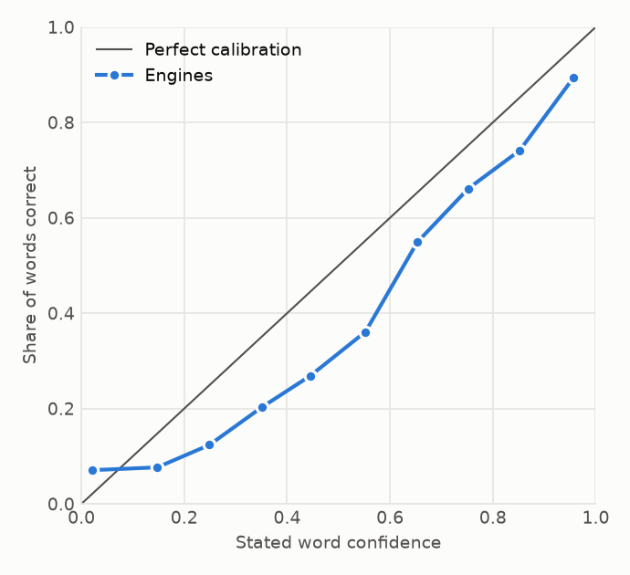

# OCR engine router benchmark

Generated: 2026-10-07. Commit: `3e7e365`. Engines run with `eng+rus`.

## Task

For each screenshot SnipText picks one of three actions: Tesseract, EasyOCR, or both merged by word confidence. The router predicts the character error rate (CER) of each action and takes the one minimising predicted CER plus a time weight times the action's seconds. Two routers are compared: one that sees only image statistics before any OCR, and a cascade that runs Tesseract first and also sees its word confidences.

CER is the edit distance to the ground truth over its length, whitespace-normalised, case kept. Averages use CER clipped at 1 so that one garbage output does not dominate; the raw mean is shown next to it. Intervals are 95% bootstrap intervals that resample texts, not images, because renders of one text are not independent.

## Data

3380 images: train 1800, test 600, unseen_font 300, val 600, ood 80. 750 distinct texts (1980 English and 1320 Russian renders; prose 2200, code 660, interface strings 440). Sentences come from UD English-EWT and UD Russian-GSD, code from the CPython 3.12 standard library. Each text is rendered several times with a random font, size from 11 to 30 px, one of six colour schemes and up to two degradations out of blur, noise, JPEG, rescaling and low contrast.

A text belongs to exactly one of train, validation and test. Two font families appear only in the unseen-font slice. The receipts (SROIE) are never used for fitting or selection.

## Result on held-out texts

Router, image features: CER 0.076 [0.063, 0.090], lower than always running Tesseract by 0.026 (paired difference -0.026 [-0.040, -0.012], 95% interval over texts).

| Policy | CER, clipped at 1 | CER, raw | Median | Regret to oracle | Difference to best static | Tesseract / EasyOCR / merge | Time, ms |
|---|---|---|---|---|---|---|---|
| Always Tesseract | 0.103 [0.084, 0.124] | 0.121 | 0.004 | 0.040 [0.028, 0.053] |  | 100% / 0% / 0% | 150 |
| Always EasyOCR | 0.308 [0.276, 0.340] | 0.308 | 0.132 | 0.245 [0.215, 0.276] |  | 0% / 100% / 0% | 43 |
| Always merge | 0.114 [0.096, 0.134] | 0.125 | 0.024 | 0.052 [0.040, 0.065] |  | 0% / 0% / 100% | 193 |
| Previous selector (rules) | 0.128 [0.106, 0.150] | 0.146 | 0.014 | 0.065 [0.051, 0.081] | +0.025 [+0.014, +0.037] | 44% / 0% / 56% | 172 |
| **Router, image features (shipped)** | 0.076 [0.063, 0.090] | 0.086 | 0.005 | 0.014 [0.008, 0.021] | -0.026 [-0.040, -0.012] | 83% / 12% / 4% | 130 |
| Router, cascade | 0.074 [0.061, 0.089] | 0.085 | 0.004 | 0.012 [0.007, 0.018] | -0.029 [-0.041, -0.017] | 93% / 4% / 4% | 153 |
| Oracle (lower bound) | 0.062 [0.050, 0.075] | 0.071 | 0.000 | 0.000 [0.000, 0.000] | -0.040 [-0.053, -0.028] | 89% / 8% / 3% | 135 |

The shipped policy is `pre_ocr`: Gradient boosting (100 trees, depth 2, learning rate 0.05), time weight 0.567. It is scored through `sniptext.router.Router`, the class the app uses, fitted from the table packaged with the app. "Best static" is always running Tesseract, chosen on train and validation.

Of the two routers the one with the lower out-of-fold CER ships, or the faster one when they are within 0.005: Router, image features has 0.075 at 131 ms per image, Router, cascade 0.070 at 148 ms.

## Unseen fonts

Router, image features: CER 0.067 [0.047, 0.089], not distinguishable from always running Tesseract (paired difference -0.006 [-0.019, +0.005], 95% interval over texts).

| Policy | CER, clipped at 1 | CER, raw | Median | Regret to oracle | Difference to best static | Tesseract / EasyOCR / merge | Time, ms |
|---|---|---|---|---|---|---|---|
| Always Tesseract | 0.074 [0.052, 0.098] | 0.087 | 0.000 | 0.015 [0.005, 0.027] |  | 100% / 0% / 0% | 143 |
| Always EasyOCR | 0.329 [0.288, 0.373] | 0.329 | 0.146 | 0.270 [0.232, 0.310] |  | 0% / 100% / 0% | 43 |
| Always merge | 0.112 [0.089, 0.138] | 0.126 | 0.023 | 0.053 [0.038, 0.070] |  | 0% / 0% / 100% | 185 |
| Previous selector (rules) | 0.105 [0.082, 0.133] | 0.119 | 0.014 | 0.046 [0.031, 0.065] | +0.032 [+0.016, +0.049] | 37% / 0% / 63% | 171 |
| **Router, image features (shipped)** | 0.067 [0.047, 0.089] | 0.081 | 0.000 | 0.008 [0.003, 0.016] | -0.006 [-0.019, +0.005] | 88% / 8% / 4% | 134 |
| Router, cascade | 0.062 [0.043, 0.084] | 0.076 | 0.000 | 0.003 [0.001, 0.007] | -0.011 [-0.023, -0.001] | 96% / 1% / 3% | 144 |
| Oracle (lower bound) | 0.059 [0.039, 0.080] | 0.073 | 0.000 | 0.000 [0.000, 0.000] | -0.015 [-0.027, -0.005] | 92% / 6% / 2% | 137 |

## Out-of-domain receipts

Photographed receipts are unlike anything in the training data. This slice shows what the router does outside its domain.

Router, image features: CER 0.417 [0.385, 0.450], higher than always running Tesseract by 0.037 (paired difference +0.037 [+0.015, +0.060], 95% interval over texts).

| Policy | CER, clipped at 1 | CER, raw | Median | Regret to oracle | Difference to best static | Tesseract / EasyOCR / merge | Time, ms |
|---|---|---|---|---|---|---|---|
| Always Tesseract | 0.381 [0.354, 0.408] | 0.381 | 0.387 | 0.003 [0.001, 0.006] |  | 100% / 0% / 0% | 650 |
| Always EasyOCR | 0.615 [0.576, 0.655] | 0.615 | 0.626 | 0.238 [0.204, 0.274] |  | 0% / 100% / 0% | 467 |
| Always merge | 0.546 [0.505, 0.587] | 0.546 | 0.535 | 0.169 [0.135, 0.204] |  | 0% / 0% / 100% | 1118 |
| Previous selector (rules) | 0.477 [0.433, 0.525] | 0.477 | 0.439 | 0.100 [0.067, 0.137] | +0.096 [+0.063, +0.134] | 57% / 0% / 42% | 842 |
| **Router, image features (shipped)** | 0.417 [0.385, 0.450] | 0.417 | 0.425 | 0.040 [0.019, 0.063] | +0.037 [+0.015, +0.060] | 78% / 22% / 0% | 572 |
| Router, cascade | 0.465 [0.427, 0.505] | 0.465 | 0.439 | 0.088 [0.054, 0.125] | +0.084 [+0.050, +0.123] | 69% / 20% / 11% | 797 |
| Oracle (lower bound) | 0.377 [0.352, 0.403] | 0.377 | 0.378 | 0.000 [0.000, 0.000] | -0.003 [-0.006, -0.001] | 88% / 5% / 8% | 673 |

## Accuracy against time


Each line traces one router as the time weight grows from 0. Times are measured on this machine with EasyOCR on a GPU.

Router, image features spans 87 to 146 ms and CER 0.072 to 0.124; Router, cascade spans 153 to 154 ms and CER 0.074 to 0.075. The cascade runs Tesseract on every image, so its time cannot fall below Tesseract's.

On a CPU EasyOCR is 4.5 times slower (measured on a sample of images). With EasyOCR times scaled by that factor and the time weight re-chosen by the same rule, on held-out texts:

| Policy | CER | Time, ms | Time weight |
|---|---|---|---|
| Always Tesseract | 0.103 | 150 | |
| Always EasyOCR | 0.308 | 192 | |
| Always merge | 0.114 | 342 | |
| Router, image features | 0.072 | 146 | 2.000 |
| Router, cascade | 0.077 | 156 | 2.000 |

## Model selection

Candidates are compared by grouped 5-fold cross-validation over train and validation texts (a text is never in both the fitting and the predicted fold), on the regret of the resulting policy to the oracle. The default time weight is the largest one that keeps out-of-fold CER within 0.005 of the accuracy-only policy.

### Router, image features

| Candidate | Out-of-fold CER | Regret to oracle |
|---|---|---|
| Gradient boosting (100 trees, depth 2, learning rate 0.05) | 0.073 | 0.012 |
| Gradient boosting (100 trees, depth 3, learning rate 0.05) | 0.073 | 0.012 |
| Gradient boosting (300 trees, depth 2, learning rate 0.05) | 0.075 | 0.014 |
| Gradient boosting (100 trees, depth 3, learning rate 0.1) | 0.075 | 0.014 |
| Gradient boosting (100 trees, depth 2, learning rate 0.1) | 0.075 | 0.014 |
| Gradient boosting (300 trees, depth 3, learning rate 0.05) | 0.077 | 0.016 |
| Gradient boosting (300 trees, depth 2, learning rate 0.1) | 0.077 | 0.016 |
| Ridge regression (alpha 10) | 0.078 | 0.017 |
| Gradient boosting (300 trees, depth 3, learning rate 0.1) | 0.078 | 0.017 |
| Ridge regression (alpha 0.1) | 0.079 | 0.017 |
| Ridge regression (alpha 1) | 0.079 | 0.017 |

Out-of-fold at its default time weight 0.567: CER 0.075, 131 ms per image.

### Router, cascade

| Candidate | Out-of-fold CER | Regret to oracle |
|---|---|---|
| Gradient boosting (100 trees, depth 3, learning rate 0.05) | 0.069 | 0.008 |
| Gradient boosting (100 trees, depth 2, learning rate 0.05) | 0.069 | 0.008 |
| Gradient boosting (300 trees, depth 2, learning rate 0.05) | 0.070 | 0.009 |
| Gradient boosting (100 trees, depth 3, learning rate 0.1) | 0.070 | 0.009 |
| Gradient boosting (100 trees, depth 2, learning rate 0.1) | 0.070 | 0.009 |
| Gradient boosting (300 trees, depth 2, learning rate 0.1) | 0.071 | 0.010 |
| Gradient boosting (300 trees, depth 3, learning rate 0.05) | 0.072 | 0.011 |
| Gradient boosting (300 trees, depth 3, learning rate 0.1) | 0.074 | 0.013 |
| Ridge regression (alpha 10) | 0.076 | 0.015 |
| Ridge regression (alpha 1) | 0.077 | 0.016 |
| Ridge regression (alpha 0.1) | 0.077 | 0.016 |

Out-of-fold at its default time weight 2.000: CER 0.070, 148 ms per image.

Tesseract is called through `image_to_data` (`detailed` call); its text differs from `image_to_string` by +0.000 mean CER on train and validation.

## Features

Inputs of the shipped router. Extraction takes 1.6 ms per image on average.

| Input | CER change when removed (out-of-fold) | CER change when shuffled (test) |
|---|---|---|
| noise_level | +0.001 | +0.028 |
| contrast | +0.001 | +0.003 |
| brightness | +0.001 | +0.001 |
| sharpness | +0.001 | +0.000 |
| edge_density | +0.000 | +0.002 |
| size_ratio | +0.000 | +0.001 |
| has_color | +0.000 | +0.000 |
| text_height | +0.000 | +0.002 |
| width | -0.000 | +0.000 |
| height | -0.000 | -0.001 |
| text_density | -0.000 | +0.006 |
| jpeg_blockiness | -0.000 | -0.001 |

## Breakdown

Mean clipped CER on held-out texts.

### By degradation

| Group | n | Always Tesseract | Always EasyOCR | Always merge | Router, image features | Oracle (lower bound) |
|---|---|---|---|---|---|---|
| blur | 65 | 0.036 | 0.326 | 0.053 | 0.036 | 0.036 |
| lowcontrast | 56 | 0.006 | 0.136 | 0.040 | 0.006 | 0.005 |
| noise | 80 | 0.334 | 0.172 | 0.155 | 0.140 | 0.087 |
| two combined | 146 | 0.176 | 0.534 | 0.208 | 0.174 | 0.148 |
| none | 135 | 0.010 | 0.131 | 0.053 | 0.010 | 0.010 |
| jpeg | 57 | 0.042 | 0.343 | 0.096 | 0.042 | 0.040 |
| rescale | 61 | 0.046 | 0.441 | 0.121 | 0.046 | 0.045 |

### By colour scheme

| Group | n | Always Tesseract | Always EasyOCR | Always merge | Router, image features | Oracle (lower bound) |
|---|---|---|---|---|---|---|
| paper | 96 | 0.095 | 0.277 | 0.134 | 0.081 | 0.070 |
| light | 103 | 0.042 | 0.265 | 0.081 | 0.053 | 0.035 |
| solarized_dark | 100 | 0.109 | 0.356 | 0.096 | 0.074 | 0.052 |
| terminal | 104 | 0.153 | 0.319 | 0.121 | 0.074 | 0.070 |
| dark | 96 | 0.064 | 0.273 | 0.108 | 0.068 | 0.045 |
| solarized_light | 101 | 0.150 | 0.354 | 0.147 | 0.109 | 0.101 |

### By language

| Group | n | Always Tesseract | Always EasyOCR | Always merge | Router, image features | Oracle (lower bound) |
|---|---|---|---|---|---|---|
| en | 360 | 0.109 | 0.332 | 0.130 | 0.089 | 0.070 |
| ru | 240 | 0.093 | 0.271 | 0.090 | 0.058 | 0.051 |

### By content

| Group | n | Always Tesseract | Always EasyOCR | Always merge | Router, image features | Oracle (lower bound) |
|---|---|---|---|---|---|---|
| prose | 400 | 0.089 | 0.302 | 0.087 | 0.062 | 0.052 |
| code | 120 | 0.148 | 0.419 | 0.228 | 0.130 | 0.111 |
| ui | 80 | 0.103 | 0.169 | 0.081 | 0.065 | 0.043 |

## The previous selector

Before this router SnipText chose between Tesseract and the merge with fixed thresholds on image statistics and a classifier fitted on hand-made feature ranges. On held-out texts it scores CER 0.128 [0.106, 0.150] and picks the merge for 56% of images.

It also retrained itself on a label derived from a text-quality score of the two outputs. Compared with the action that really had the lower CER, that label agrees on 36% of 3300 synthetic images (Cohen's kappa 0.03); it names the merge for 70% of images while the merge is better on 9%. Online retraining was removed for that reason.

## Confidence calibration

Per-word confidence against word correctness. ECE is the population-weighted gap between confidence and accuracy over 10 bins. The calibrated column refits an isotonic map on 70% of the images and measures on the rest.

| Domain | Words | Accuracy | Mean confidence | ECE raw | ECE calibrated |
|---|---|---|---|---|---|
| sroie | 14574 | 0.420 | 0.779 | 0.397 | 0.045 |
| synthetic | 100115 | 0.818 | 0.855 | 0.040 | 0.010 |
| all | 114689 | 0.768 | 0.846 | 0.087 | 0.012 |



The merge replayed on held-out texts with three ways of resolving disagreements:

| Domain | Images | CER, text heuristic | CER, raw confidence | CER, calibrated |
|---|---|---|---|---|
| sroie | 24 | 0.502 | 0.561 | 0.483 |
| synthetic | 990 | 0.132 | 0.105 | 0.087 |
| all | 1014 | 0.141 | 0.116 | 0.096 |

## Limitations

- The images are rendered, not captured. Real screenshots have anti-aliasing, mixed fonts, icons and layouts this corpus does not cover; no manually transcribed screenshots are included.
- English and Russian only, with engines configured for both. A single-language setup may rank the engines differently.
- Times are from one machine. The time weight trades error for seconds as measured there.
- EasyOCR reports one confidence per detected line; the word-level merge treats it as the confidence of every word in the line.

## Reproduce

```bash
venv/bin/python benchmarks/run_eval.py      # engines over the corpus, resumable
venv/bin/python benchmarks/train_router.py  # selection, evaluation, packaged table
venv/bin/python benchmarks/report.py        # this file and its figures
```
